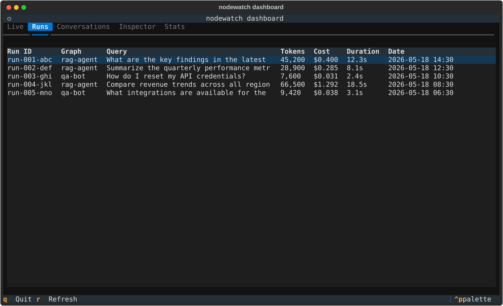
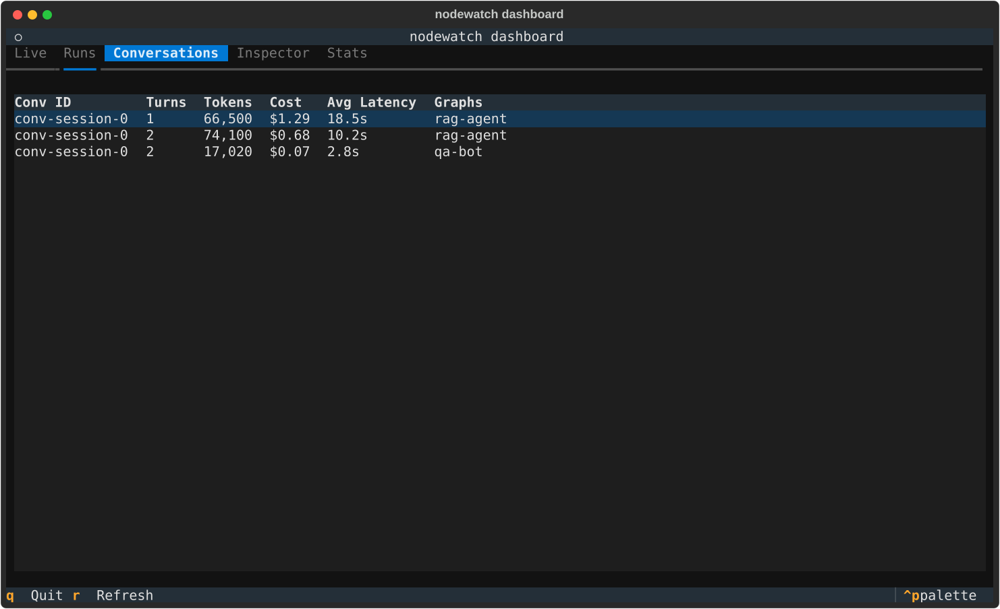
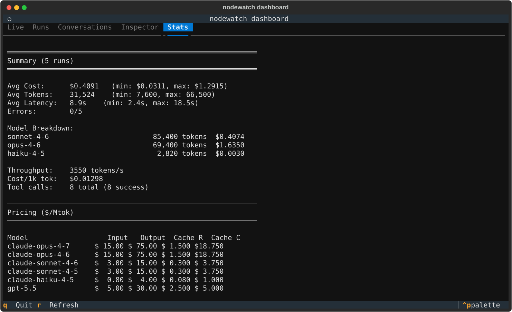
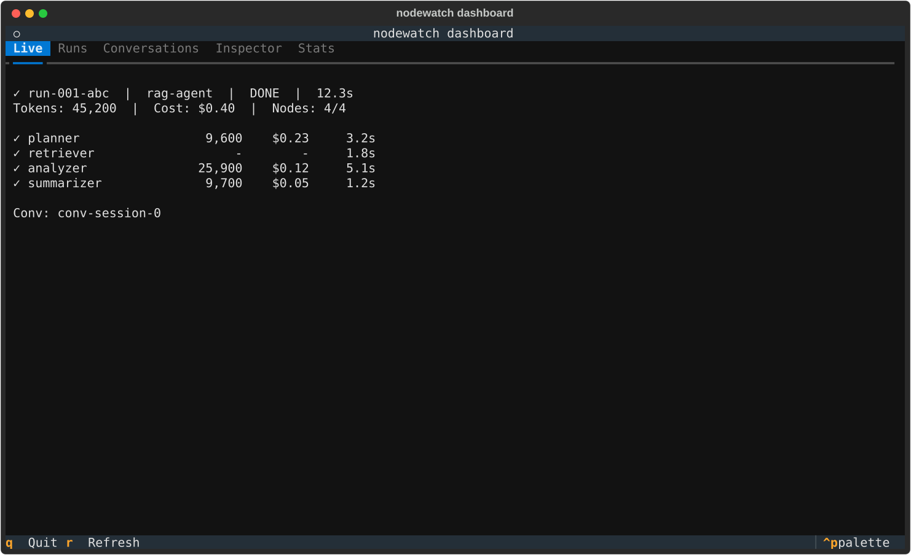

# Dashboard (Interactive TUI)

The dashboard is the primary way to explore your LangGraph observability data. A full-screen terminal app with keyboard navigation — no browser needed.

```bash
nodewatch dashboard
```

## Runs — browse all stored executions


## Inspector — per-node breakdown of a selected run



## Conversations — runs grouped by thread



## Stats & Pricing — aggregate metrics and model costs



## Live — real-time view of active executions



## Features

| Tab | Key | What you see |
|-----|-----|--------------|
| **Live** | `1` | Real-time view of active runs (auto-refreshes every 2s) |
| **Runs** | `2` | All stored runs — tokens, cost, duration, date |
| **Conversations** | `3` | Runs grouped by thread — total cost per session |
| **Inspector** | `4` | Per-node breakdown of a selected run (model, tokens, cost, tools) |
| **Stats** | `5` | Aggregate metrics + model pricing table |
| **Logs** | `6` | Tails the file named by `NODEWATCH_LOG_PATH` (raw, markup disabled) |

Every column in the **Runs** and **Conversations** tables is sortable — click a header to
sort by it, click again to reverse. Conversations default to **Conv ID descending** (newest
first) and Runs to Date descending. Sorting is instant: it reorders cached rows rather than
refetching, and survives a refresh.

## Keyboard shortcuts

| Key | Action |
|-----|--------|
| `1`–`6` | Switch tabs (always works, even when a table is focused) |
| `↑` / `↓` | Navigate table rows |
| `Enter` | Inspect selected run / drill into conversation |
| Click a column header | Sort the table by that column; click again to reverse |
| `s` / `S` | Sort by next column / reverse the current sort (focused table) |
| `r` | Refresh data from server (non-blocking — old data stays visible) |
| `q` | Quit |

## How it works

- On startup, fetches data once in the background
- **Tab switching is instant** — all tables stay in memory
- Sorting reorders the in-memory rows, so it never re-queries the server
- Pressing `r` fetches fresh data without freezing the UI; old content remains until the update arrives
- Works with both local SQLite and remote API (auto-detected via `NODEWATCH_URL`)

## Install & run

```bash
pip install "llm-nodewatch[client]"
export NODEWATCH_URL=https://your-server/api/nodewatch
nodewatch dashboard
```

---

